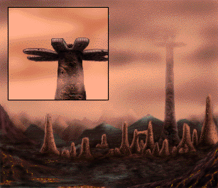

# leela
Leela CSS Framework

This is a mishmash of free code and examples given out throughout the Internet.  There's no JavaScript, so who cares.  It's just HTML and CSS.

These are the templates I use to make websites.  They are what they are, and if you want to use them, that's your business.  I don't really care.

There's probably no way to actually release this under a license.

Also, I'm going to put my own account names and domain names in these. You're going to have to remove those if you want to use this.

Literally just use view-source to get the code because the people who made HTML are absolutely ridiculous and the CODE tag does NOTHING.

<a href="css.gradient.counter.list.html">CSS Gradient Counter List</a> by Mattia Astorino

The Terminals

<b>Original Size from Marathon 2 and Marathon Infinity</b>

UESCTerm 802.11 (remote override) 
05.10.2337

The first Pfhor dropship landed twelve 
minutes ago, and their troopers have 
already penetrated the hull.&nbsp;&nbsp;It seems that 
our standard operating procedure calls for 
me to transport you into the worst  
fighting.&nbsp;&nbsp;Maybe you can slow them down.
 
 
It may only seem like a matter of hours  
since your last battle here, but remember  
that seventeen years have passed for those  
of us who did not spend the voyage from Tau  
Ceti in a stasis chamber.  A few things  
have changed:
 
 
We're helpless on Lh'owon's second moon. 
Our engines have been destroyed and all  
primary weapons are off-line.  Life support  
has failed in most areas.
 
 
Enjoy yourself.

PgUp/PgDown/Arrows To Scroll Return/Enter To Acknowledge

